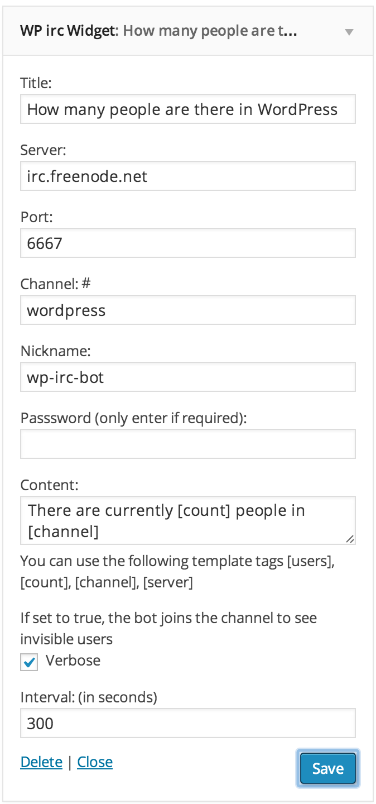

# wp-irc #
**Contributors:** sudar  
**Tags:** irc, sidebar, widget  
**Requires at least:** 3.2  
**Tested up to:** 3.5.1  
**Donate Link:** http://sudarmuthu.com/if-you-wanna-thank-me  
**Stable tag:** 1.2  

Retrieves the number of people who are online in an IRC Channel, which can be displayed in the sidebar using a widget.

## Description ##

Well WP-IRC Plugin (for lack of a better name ;) ) can fetch the number of users online in any IRC channel and can be scheduled to auto refresh it every x.minutes. The count thus fetched can be displayed in the sidebar of your blog using a sidebar widget provided by the Plugin.

More details about the Plugin can be found at the [Plugins Home page][1].

### Translation

The pot file is available with the Plugin. If you are willing to do translation for the Plugin, use the pot file to create the .po files for your language and let me know. I will add it to the Plugin after giving credit to you.

### Development and Support

The development of the Plugin happens over at [github][6]. If you want to contribute to the Plugin, fork the [project at github][6] and send me a pull request.

If you are not familiar with either git or Github then refer to this [guide to see how fork and send pull request](http://sudarmuthu.com/blog/contributing-to-project-hosted-in-github).

Support for the Plugin is available from the [Plugin's home page][1]. If you have any questions or suggestions, do leave a comment there or contact me in [twitter][2].

### TODO

- Create a settings page where people can test connection
- Add support for shortcode
- Add support for alerts

### Stay updated

I would be posting updates about this Plugin in my [blog][3] and in [Twitter][2]. If you want to be informed when new version of this Plugin is released, then you can either subscribe to this [blog's RSS feed][5] or [follow me in Twitter][2].

### Links

*   [Plugin home page][1]
*   [Author's Blog][3]
*   [Other Plugins by the author][4]

 [1]: http://sudarmuthu.com/wordpress/wp-irc
 [2]: http://twitter.com/sudarmuthu
 [3]: http://sudarmuthu.com/blog
 [4]: http://sudarmuthu.com/wordpress
 [5]: http://sudarmuthu.com/feed
 [6]: https://github.com/sudar/wp-irc

## Installation ##

Extract the zip file and just drop the contents in the wp-content/plugins/ directory of your WordPress installation and then activate the Plugin from Plugins page.

After activation, go to the widgets configuration page. You should find the IRC Widget under available widget.

## Screenshots ##

Widget settings screen

This is how the widget will appear in the frontend

## Readme Generator 

This Readme file was generated using <a href = 'http://sudarmuthu.com/wordpress/wp-readme'>wp-readme</a>, which generates readme files for WordPress Plugins.
